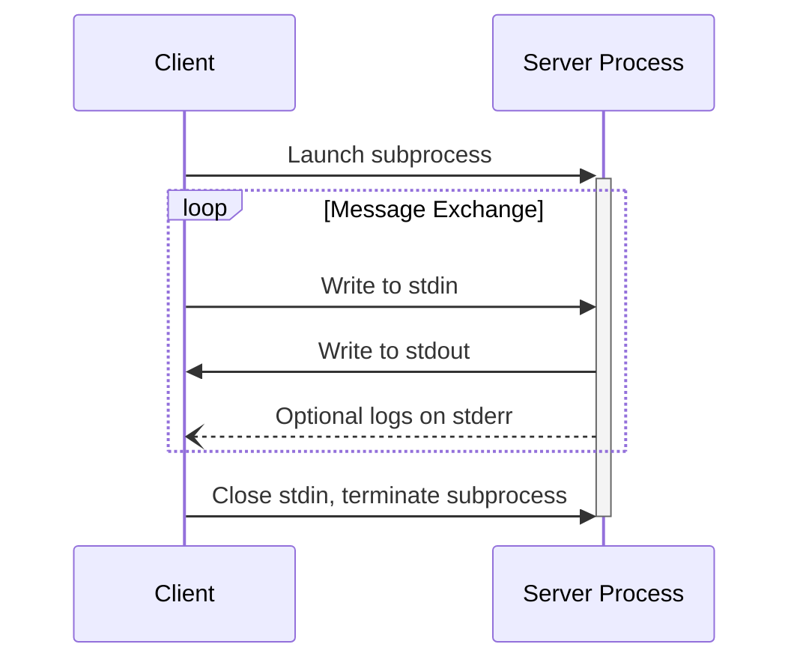
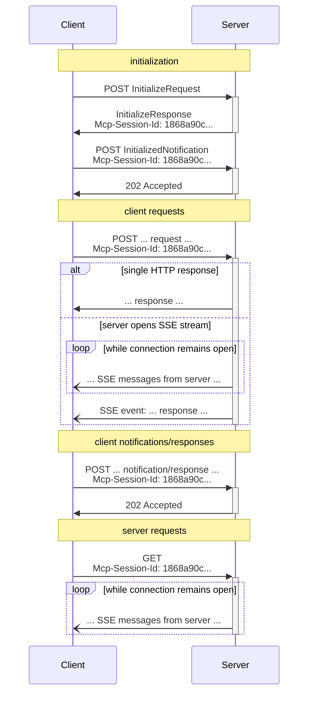

<Info>**Protocol Revision**: 2025-06-18</Info>

MCP uses JSON-RPC to encode messages. JSON-RPC messages **MUST** be UTF-8 encoded.

The protocol currently defines two standard transport mechanisms for client-server
communication:

1. [stdio](#stdio), communication over standard in and standard out
2. [Streamable HTTP](#streamable-http)

Clients **SHOULD** support stdio whenever possible.

It is also possible for clients and servers to implement
[custom transports](#custom-transports) in a pluggable fashion.

## stdio

In the **stdio** transport:

- The client launches the MCP server as a subprocess.
- The server reads JSON-RPC messages from its standard input (`stdin`) and sends messages
  to its standard output (`stdout`).
- Messages are individual JSON-RPC requests, notifications, or responses.
- Messages are delimited by newlines, and **MUST NOT** contain embedded newlines.
- The server **MAY** write UTF-8 strings to its standard error (`stderr`) for logging
  purposes. Clients **MAY** capture, forward, or ignore this logging.
- The server **MUST NOT** write anything to its `stdout` that is not a valid MCP message.
- The client **MUST NOT** write anything to the server's `stdin` that is not a valid MCP
  message.

## Streamable HTTP

<Info>

This replaces the [HTTP+SSE
transport](/specification/2024-11-05/basic/transports#http-with-sse) from
protocol version 2024-11-05. See the [backwards compatibility](#backwards-compatibility)
guide below.

</Info>

In the **Streamable HTTP** transport, the server operates as an independent process that
can handle multiple client connections. This transport uses HTTP POST and GET requests.
Server can optionally make use of
[Server-Sent Events](https://en.wikipedia.org/wiki/Server-sent_events) (SSE) to stream
multiple server messages. This permits basic MCP servers, as well as more feature-rich
servers supporting streaming and server-to-client notifications and requests.

The server **MUST** provide a single HTTP endpoint path (hereafter referred to as the
**MCP endpoint**) that supports both POST and GET methods. For example, this could be a
URL like `https://example.com/mcp`.

#### Security Warning

When implementing Streamable HTTP transport:

1. Servers **MUST** validate the `Origin` header on all incoming connections to prevent DNS rebinding attacks
2. When running locally, servers **SHOULD** bind only to localhost (127.0.0.1) rather than all network interfaces (0.0.0.0)
3. Servers **SHOULD** implement proper authentication for all connections

Without these protections, attackers could use DNS rebinding to interact with local MCP servers from remote websites.

### Sending Messages to the Server

Every JSON-RPC message sent from the client **MUST** be a new HTTP POST request to the
MCP endpoint.

1. The client **MUST** use HTTP POST to send JSON-RPC messages to the MCP endpoint.
2. The client **MUST** include an `Accept` header, listing both `application/json` and
   `text/event-stream` as supported content types.
3. The body of the POST request **MUST** be a single JSON-RPC _request_, _notification_, or _response_.
4. If the input is a JSON-RPC _response_ or _notification_:
   - If the server accepts the input, the server **MUST** return HTTP status code 202
     Accepted with no body.
   - If the server cannot accept the input, it **MUST** return an HTTP error status code
     (e.g., 400 Bad Request). The HTTP response body **MAY** comprise a JSON-RPC _error
     response_ that has no `id`.
5. If the input is a JSON-RPC _request_, the server **MUST** either
   return `Content-Type: text/event-stream`, to initiate an SSE stream, or
   `Content-Type: application/json`, to return one JSON object. The client **MUST**
   support both these cases.
6. If the server initiates an SSE stream:
   - The SSE stream **SHOULD** eventually include JSON-RPC _response_ for the
     JSON-RPC _request_ sent in the POST body.
   - The server **MAY** send JSON-RPC _requests_ and _notifications_ before sending the
     JSON-RPC _response_. These messages **SHOULD** relate to the originating client
     _request_.
   - The server **SHOULD NOT** close the SSE stream before sending the JSON-RPC _response_
     for the received JSON-RPC _request_, unless the [session](#session-management)
     expires.
   - After the JSON-RPC _response_ has been sent, the server **SHOULD** close the SSE
     stream.
   - Disconnection **MAY** occur at any time (e.g., due to network conditions).
     Therefore:
     - Disconnection **SHOULD NOT** be interpreted as the client cancelling its request.
     - To cancel, the client **SHOULD** explicitly send an MCP `CancelledNotification`.
     - To avoid message loss due to disconnection, the server **MAY** make the stream
       [resumable](#resumability-and-redelivery).

### Listening for Messages from the Server

1. The client **MAY** issue an HTTP GET to the MCP endpoint. This can be used to open an
   SSE stream, allowing the server to communicate to the client, without the client first
   sending data via HTTP POST.
2. The client **MUST** include an `Accept` header, listing `text/event-stream` as a
   supported content type.
3. The server **MUST** either return `Content-Type: text/event-stream` in response to
   this HTTP GET, or else return HTTP 405 Method Not Allowed, indicating that the server
   does not offer an SSE stream at this endpoint.
4. If the server initiates an SSE stream:
   - The server **MAY** send JSON-RPC _requests_ and _notifications_ on the stream.
   - These messages **SHOULD** be unrelated to any concurrently-running JSON-RPC
     _request_ from the client.
   - The server **MUST NOT** send a JSON-RPC _response_ on the stream **unless**
     [resuming](#resumability-and-redelivery) a stream associated with a previous client
     request.
   - The server **MAY** close the SSE stream at any time.
   - The client **MAY** close the SSE stream at any time.

### Multiple Connections

1. The client **MAY** remain connected to multiple SSE streams simultaneously.
2. The server **MUST** send each of its JSON-RPC messages on only one of the connected
   streams; that is, it **MUST NOT** broadcast the same message across multiple streams.
   - The risk of message loss **MAY** be mitigated by making the stream
     [resumable](#resumability-and-redelivery).

### Resumability and Redelivery

To support resuming broken connections, and redelivering messages that might otherwise be
lost:

1. Servers **MAY** attach an `id` field to their SSE events, as described in the
   [SSE standard](https://html.spec.whatwg.org/multipage/server-sent-events.html#event-stream-interpretation).
   - If present, the ID **MUST** be globally unique across all streams within that
     [session](#session-management)—or all streams with that specific client, if session
     management is not in use.
2. If the client wishes to resume after a broken connection, it **SHOULD** issue an HTTP
   GET to the MCP endpoint, and include the
   [`Last-Event-ID`](https://html.spec.whatwg.org/multipage/server-sent-events.html#the-last-event-id-header)
   header to indicate the last event ID it received.
   - The server **MAY** use this header to replay messages that would have been sent
     after the last event ID, _on the stream that was disconnected_, and to resume the
     stream from that point.
   - The server **MUST NOT** replay messages that would have been delivered on a
     different stream.

In other words, these event IDs should be assigned by servers on a _per-stream_ basis, to
act as a cursor within that particular stream.

### Session Management

An MCP "session" consists of logically related interactions between a client and a
server, beginning with the [initialization phase](/specification/2025-06-18/basic/lifecycle). To support
servers which want to establish stateful sessions:

1. A server using the Streamable HTTP transport **MAY** assign a session ID at
   initialization time, by including it in an `Mcp-Session-Id` header on the HTTP
   response containing the `InitializeResult`.
   - The session ID **SHOULD** be globally unique and cryptographically secure (e.g., a
     securely generated UUID, a JWT, or a cryptographic hash).
   - The session ID **MUST** only contain visible ASCII characters (ranging from 0x21 to
     0x7E).
2. If an `Mcp-Session-Id` is returned by the server during initialization, clients using
   the Streamable HTTP transport **MUST** include it in the `Mcp-Session-Id` header on
   all of their subsequent HTTP requests.
   - Servers that require a session ID **SHOULD** respond to requests without an
     `Mcp-Session-Id` header (other than initialization) with HTTP 400 Bad Request.
3. The server **MAY** terminate the session at any time, after which it **MUST** respond
   to requests containing that session ID with HTTP 404 Not Found.
4. When a client receives HTTP 404 in response to a request containing an
   `Mcp-Session-Id`, it **MUST** start a new session by sending a new `InitializeRequest`
   without a session ID attached.
5. Clients that no longer need a particular session (e.g., because the user is leaving
   the client application) **SHOULD** send an HTTP DELETE to the MCP endpoint with the
   `Mcp-Session-Id` header, to explicitly terminate the session.
   - The server **MAY** respond to this request with HTTP 405 Method Not Allowed,
     indicating that the server does not allow clients to terminate sessions.

### Sequence Diagram

### Protocol Version Header

If using HTTP, the client **MUST** include the `MCP-Protocol-Version:
<protocol-version>` HTTP header on all subsequent requests to the MCP
server, allowing the MCP server to respond based on the MCP protocol version.

For example: `MCP-Protocol-Version: 2025-06-18`

The protocol version sent by the client **SHOULD** be the one [negotiated during
initialization](/specification/2025-06-18/basic/lifecycle#version-negotiation).

For backwards compatibility, if the server does _not_ receive an `MCP-Protocol-Version`
header, and has no other way to identify the version - for example, by relying on the
protocol version negotiated during initialization - the server **SHOULD** assume protocol
version `2025-03-26`.

If the server receives a request with an invalid or unsupported
`MCP-Protocol-Version`, it **MUST** respond with `400 Bad Request`.

### Backwards Compatibility

Clients and servers can maintain backwards compatibility with the deprecated [HTTP+SSE
transport](/specification/2024-11-05/basic/transports#http-with-sse) (from
protocol version 2024-11-05) as follows:

**Servers** wanting to support older clients should:

- Continue to host both the SSE and POST endpoints of the old transport, alongside the
  new "MCP endpoint" defined for the Streamable HTTP transport.
  - It is also possible to combine the old POST endpoint and the new MCP endpoint, but
    this may introduce unneeded complexity.

**Clients** wanting to support older servers should:

1. Accept an MCP server URL from the user, which may point to either a server using the
   old transport or the new transport.
2. Attempt to POST an `InitializeRequest` to the server URL, with an `Accept` header as
   defined above:
   - If it succeeds, the client can assume this is a server supporting the new Streamable
     HTTP transport.
   - If it fails with an HTTP 4xx status code (e.g., 405 Method Not Allowed or 404 Not
     Found):
     - Issue a GET request to the server URL, expecting that this will open an SSE stream
       and return an `endpoint` event as the first event.
     - When the `endpoint` event arrives, the client can assume this is a server running
       the old HTTP+SSE transport, and should use that transport for all subsequent
       communication.

## Pure HTTP

In the **Pure HTTP** transport, the server operates as an independent process that
can handle multiple client connections. This transport uses conventional HTTP requests.
The Pure HTTP transport supports bidirectional message exchange and all current
client-to-server and server-to-client MCP requests and notifications.

### Supporting bidirectional message exchange

Clients send requests and notifications to servers with HTTP GET or POST requests.
Servers send replies to client requests in the response of the HTTP request.
Clients accept requests and notifications from servers in the response to GET requests
on endpoints specific to requests or notifications.
Clients send replies to server requests with an HTTP POST to an endpoint specific to the
type of request received from the server.

The high-level mapping of MCP messages to HTTP is as follows:

- "*/list" and "*/get" requests are mapped to HTTP GET requests.
  - Params are passed either in query string or headers
- "tools/call" is mapped to HTTP PUT
- All other requests are mapped to HTTP POST

### Security Warning

The Pure HTTP transport has similar implementation concerns as the Streamable HTTP transport:

1. Servers **MUST** validate the `Origin` header on all incoming connections to prevent DNS rebinding attacks
2. When running locally, servers **SHOULD** bind only to localhost (127.0.0.1) rather than all network interfaces (0.0.0.0)
3. Servers **SHOULD** implement proper authentication for all connections

Without these protections, attackers could use DNS rebinding to interact with local MCP servers from remote websites.

### Sending Messages from Client to Server

For each message sent from client to server:

1. The client **MUST** issue an HTTP request with the method and path specified in the table below.
2. The client **MUST** include the `MCP-Protocol-Version: <protocol-version>` header in the HTTP request to
specify the protocol version of the message and any response to the message.
2. For request messages using POST or PUT, the body of the HTTP request **MUST** be the "params" of the corresponding "Request" structure,
specified in the table below, including the "_meta" property of "JSONRPCRequest".
3. For request messages using GET, the "params" of the corresponding "Request" structure including the "_meta" property of "JSONRPCRequest",
**MUST** be sent in headers, except the "cursor" parameter of "*/list" messages, which **MUST** be sent in the query string.
3. The client **SHOULD** include an `Mcp-Request-Id` request header with a globally unique identifier for request messages, to support cancellation.
4. For notification messages, the body of the HTTP request **MUST** be the corresponding "Notification" structure,
specified in the table below.
5. For response messages, the body of the HTTP request **MUST** be the corresponding "Result" structure.
The ID of the request **MUST** be sent in the `Mcp-Request-Id` request header.
6. The server **MUST** send the result of request messages from client in the response of the HTTP request.
The body of the response **MUST** be the corresponding "Result" structure.
7. The Content-type of the response to client requests should be `application/json`, except for a "resource/read" that returns binary content.
For binary content, the Content-type should specify the content type of the resource.
8. The server **SHOULD** include an ETag header in the response to "*/list" requests to allow a subsequent request to use
the `if-modified` to efficiently check for list updates.

The following table provides a complete mapping from MCP message to HTTP Method and Path for client to server messages:

<!-- jq -r '.. | objects | if .properties.method.const then .properties.method.const else empty end' schema/2025-06-18/schema.json | sort -->

| MCP message              | HTTP Method | HTTP Path |
| ------------------------ | ----------- | --------- |
| **Requests**             | | |
| completion/complete      | POST | /completions |
| initialize               | POST | /initialize |
| logging/setLevel         | POST | /logLevel |
| ping                     | GET  | /ping |
| prompts/get              | POST | /prompts/{name} |
| prompts/list             | GET  | /prompts |
| resources/list           | GET  | /resources |
| resources/read           | POST | /resources |
| resources/subscribe      | POST | /resources/subscribe |
| resources/templates/list | GET  | /resources/templates |
| resources/unsubscribe    | POST | /resources/unsubscribe |
| tools/list               | GET  | /tools |
| tools/call               | PUT  | /tools/{name}/calls/{guid} |
| **Notifications**        | | |
| notifications/cancelled          | POST | /notifications |
| notifications/initialized        | POST | /notifications |
| notifications/progress           | POST | /notifications |
| notifications/roots/list_changed | POST | /notifications |
| **Responses**            | | |
| elicit/request           | POST | /responses |
| ping                     | POST | /responses |
| roots/list               | POST | /responses |
| sampling/createMessage   | POST | /responses |

### Sending Messages from Server to Client

The server sends requests and notifications to the client in the response to HTTP GET requests
issued to the "/requests" and "/notifications" endpoints, respectively.

1. The server **MUST** implement a GET method on the "/requests" and "/notifications" endpoints to
send requests and notifications to the client.
2. The response of the GET on "/requests" **MUST** be a 200 with a "ServerRequest" body or 204: NoContent.
A 200 response also must include an Mcp-Request-Id response header with a globally unique identifier for the request.
3. The response body of the GET on "/notifications" **MUST** be an array of "ServerNotification" messages (which may be empty).
4. The response to a GET on "/requests" or "/notifications":
  - **MUST** have "Content-Type" of `application/json`
  - **MUST** include the `MCP-Protocol-Version: <protocol-version>` header to specify the protocol version of the message and any response to the message.

#### The "/requests" endpoint

When the server wishes to send a request to the client, it should add it to a collection of server-to-client requests and mark it "active". When the client issues a GET request to "/requests", the server should respond with the "oldest" "active" messages and then mark this message as "pending". This will prevent the same message from being immediately redelivered to the client on a subsequent GET to "/requests". When the server receives a response from the client to a pending request, it should be marked "complete" and is then eligible for garbage collection.

Periodically the server should mark requests that have been "pending" for longer than some timeout period as "active" so that the request is redelivered to the client. Clients should implement logic to avoid duplicate processing of a retried request.

#### The "/notifications" endpoint

Because a GET method cannot alter the state of the server, a mechanism is needed for managing the lifecycle of notifications
from the server to the client. This is done by tracking groups of notification messages returned by a GET request to "/notifications" and allowing the client to acknowledge these messages on a subsequent POST to "/notifications".

1. Each response to a GET request on "/notifications" **SHOULD** include an "Mcp-Message-Group" header with a globally unique value.
This header **MAY** be omitted if the GET returns an empty array.
2. When receiving the response of a GET request on "/notifications" that contains an "Mcp-Message-Group" header, the client **SHOULD** send a POST to the server's "/notifications" endpoint with an "Mcp-Message-Group" request header with the same value when all the notifications in the group have been delivered to the MCP Host.
  - A POST to "/notifications" with a "Mcp-Message-Group" request header may also contain notifications to be delivered to
    the server in the request body.

### Summary of server endpoints

The following table summarizes the endpoints provided by the MCP Server using the Pure HTTP transport.

<!-- jq -r '.. | objects | if .properties.method.const then .properties.method.const else empty end' schema/2025-06-18/schema.json | sort -->

| HTTP Path            | Method | related MCP message   | Request Body | Response |
| -------------------- | ------ | --------------------- | ------------ | -------- |
| /completions         | POST   | completion/complete   | CompleteRequest.params (*) | 200: CompleteResult |
| /initialize          | POST   | initialize            | InitializeRequest.params (*) | 200: InitializeResult |
| /logLevel            | POST   | logging/setLevel      | SetLevelRequest.params (*) | 202: Accepted |
| /notifications       | GET    | notifications/* (to client) |  | 200: [ServerNotification] |
| /notifications       | POST   | notifications/* (to server) | [ClientNotification] | 202: Accepted |
| /ping                | GET    | ping (from client)    |  | 202: Accepted |
| /prompts             | GET    | prompts/list          |  | 200: ListPromptsResult |
| /prompts/{name}      | POST   | prompts/get           | GetPromptRequest.params (*) | 200: GetPromptResult |
| /requests            | GET    | _multiple_            |  | 200: ServerRequest |
| /resources           | GET    | resources/list        |  | 200: ListResourcesResult |
| /resources           | POST   | resources/read        | ReadResourceRequest.params (*) | 200: ReadResourceResult |
| /resources/subscribe | POST   | resources/subscribe   | SubscribeRequest.params (*) | 202: Accepted |
| /resources/templates | GET    | resources/templates/list |   | 200: ListResourceTemplatesResult |
| /resources/unsubscribe | POST | resources/unsubscribe | UnsubscribeRequest.params (*) | 202: Accepted |
| /responses           | POST   | _multiple_            | [ClientResult] | 202: Accepted |
| /tools               | GET    | tools/list            |   | 200: ListToolsResult |
| /tools/{name}/calls/{guid} | PUT | tools/call         | CallToolRequest.params (*) | 200: CallToolResult |

(*): Includes the "_meta" property of "JSONRPCRequest".

### Cancellation

The Pure HTTP transport supports cancellation as required in the base architecture. But rather than use the JSON RPC message
id to identify the request to be cancelled, the Pure HTTP transport uses a globally unique `Mcp-Request-Id` value
passed in an HTTP header along with the request.

Clients that control the assignment of JSON RPC message IDs **SHOULD** (for simplicity) assign globally unique IDs
and then simply use the same value for `Mcp-Request-Id`. Clients that do not control assignment of JSON RPC message IDs,
or that choose not to assign globally unique IDs, **SHOULD** maintain a mapping of JSON RPC message ID to `Mcp-Request-Id`
to support request cancellation.

Servers **SHOULD** assign globally unique JSON RPC message IDs to their requests and use the same value for `Mcp-Request-Id`.

### HTTP Cookies

The HTTP standard allows servers to request that clients store server state (cookies) and include this state
in subsequent requests.

Clients **MUST** store and return HTTP cookies set by the server, as described in the HTTP standard.

### Session Management

The initial version of the Pure HTTP transport does not offer support for sessions. There is
considerable ambiguity and disagreement about the current session management feature of the
Streamable HTTP transport, and until there is consensus on the meaning / purpose / behavior
of sessions it is best to omit them from the Pure HTTP transport.

### Backwards Compatibility

Clients and servers can provide backwards compatibility with the Streamable HTTP transport
or the deprecated [HTTP+SSE transport](/specification/2024-11-05/basic/transports#http-with-sse)
(from protocol version 2024-11-05) as follows:

**Servers** wanting to support older clients should:

- Continue to host both the SSE and POST endpoints of the HTTP+SSE transport.
- Continue to host the "MCP endpoint" defined for the Streamable HTTP transport.

**Clients** wanting to support older servers should:

1. Accept an MCP server URL from the user, which may point to either a server using a prior
   transport or the new Pure HTTP transport.
2. Attempt to POST an `InitializeRequest` to the "/initialize" server URL:
   - If it succeeds, the client can assume this is a server supporting the new Pure HTTP
     transport.
   - If it fails with an HTTP 4xx status code (e.g., 405 Method Not Allowed or 404 Not
     Found), follow the steps described above to check for the Streamable HTTP transport
     or HTTP+SSE transport.

<!-- Pure HTTP -->

## Custom Transports

Clients and servers **MAY** implement additional custom transport mechanisms to suit
their specific needs. The protocol is transport-agnostic and can be implemented over any
communication channel that supports bidirectional message exchange.

Implementers who choose to support custom transports **MUST** ensure they preserve the
JSON-RPC message format and lifecycle requirements defined by MCP. Custom transports
**SHOULD** document their specific connection establishment and message exchange patterns
to aid interoperability.
